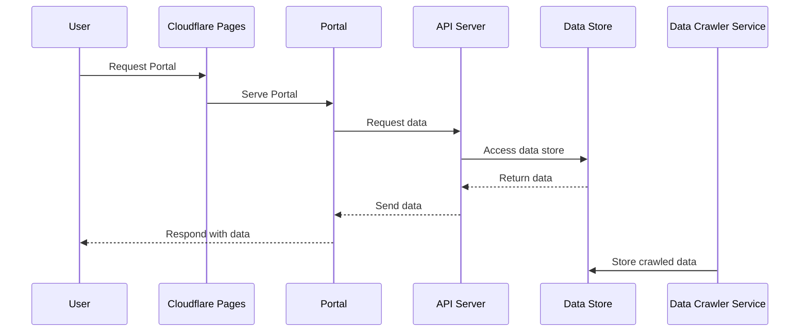

# TDR Portal

## 技術

使用する技術

### 共通

- Swagger
  - API の仕様をスキーマファーストで策定
  - フロントエンドとバックエンドの間で API の仕様を共有することで安定した開発ができる
  - codegen による型安全な API クライアント、モッキングの実現
- dependabot
  - 依存関係の更新を自動でマージしてくれる

### フロントエンド

- Next.js
- shadcn/ui
- Tailwind CSS
- TypeScript
- Storybook
- msw
- Vitest
  - ブラウザモードでテストできる
- lucide
  - アイコン
- eslint
- prettier

### バックエンド

- Rust
  - 使いたいだけ
  - https://developers.cloudflare.com/workers/languages/rust/
- tokio
- axum
- serde
- sqlx
- diesel

### インフラ

無料枠が充実しているので Cloudflare を使用する

- Cloudflare Pages
- Cloudflare D1
- Cloudflare Workers
  - Wrangler による良好な開発体験を期待して

#### CI/CD

- GitHub Actions
  - eslint
  - tsc
  - vitest
  - renovate
- Cloudflare の Git integration を使用する
  - Pages: https://developers.cloudflare.com/pages/get-started/git-integration/
  - Workers: https://developers.cloudflare.com/workers/ci-cd/

## ドメイン

このアプリで達成したいこと

### ユーザージャーニー

1. 各施設の待ち時間を確認できる
2. ショー・パレードのスケジュールを簡単に確認できる
3. フードメニューと価格、場所を確認できる

### シーケンス図

## TODO

- [ ] ドメインモデル作成
- [ ] Figma デザイン起こし
- [ ] OpenAPI スキーマ定義
